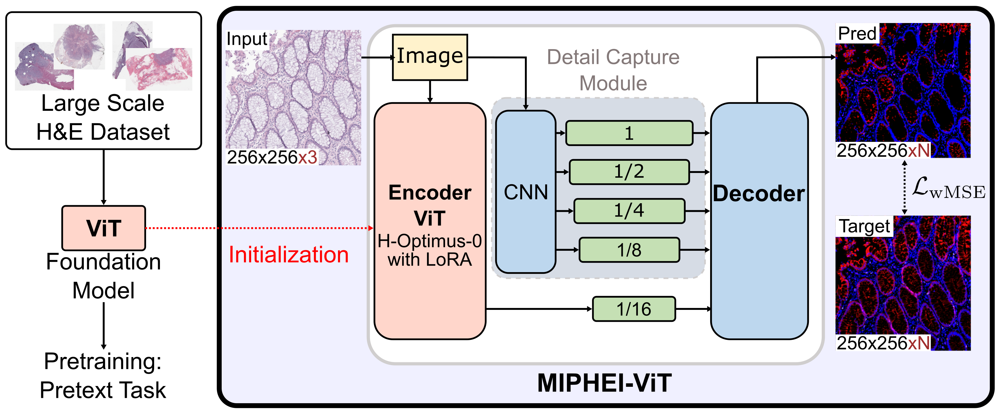

# **MIPHEI-ViT: Multiplex Immunofluorescence Prediction from H&E Images using ViT Foundation Models**

<p align="center">
  
</p>

<p align="center">
  <a href="https://www.sciencedirect.com/science/article/pii/S0010482526001277" target="_blank" rel="noopener noreferrer">
    
  </a>
  <a href="https://arxiv.org/abs/2505.10294" target="_blank" rel="noopener noreferrer">
    
  </a>
  <a href="https://zenodo.org/records/15340874" target="_blank" rel="noopener noreferrer">
    
  </a>
  <a href="https://colab.research.google.com/github/Sanofi-Public/MIPHEI-ViT/blob/main/notebooks/colab_inference.ipynb">
    
  </a>
  <a href="https://miphei-vit-demo.minesparis.psl.eu/" target="_blank" rel="noopener noreferrer">
    
  </a>
</p>

We introduce **MIPHEI-ViT**, a **U-Net-style** architecture that leverages the **H-Optimus-0** ViT foundation model as an encoder to predict multi-channel mIF images from H&E slides. Inspired by ViTMatte, the model combines a hybrid transformer–convolutional encoder with a convolutional decoder.

This repository supports full **reproducibility** of our paper on predicting **multiplex immunofluorescence (mIF)** from standard **H&E-stained histology images**. It includes all **code**, **pretrained models**, and **preprocessing steps** to replicate our results or apply the approach to new datasets.

The demo is **no longer hosted on Hugging Face** and is now self-hosted. Try it here: <a href="https://miphei-vit-demo.minesparis.psl.eu/" target="_blank" rel="noopener noreferrer"></a>

---

## 📋 Table of Contents

- [Quick Start](#-quick-start)
- [Installation](#-installation)
- [Data Download](#-data-download)
- [Model Weights](#-model-weights)
- [Inference](#️-inference)
- [Benchmark](#-benchmark)
- [Training](#-training)
- [SlideVips](#-slidevips)
- [Preprocessing Pipeline](#-preprocessing-pipeline)
- [Project Status](#️-project-status)
- [Citation](#-citation)

---

## ⚡ Quick Start

```bash
# 1. Install with conda (or with uv, see below)
conda env create -f environment.yaml --name miphei && conda activate miphei

# 2. Download MIPHEI-ViT weights
python scripts/download_miphei.py --out-dir MIPHEI-vit

# 3. Run WSI inference
python run_wsi_inference.py \
  --slide_path path/to/slide.svs \
  --checkpoint_dir MIPHEI-vit \
  --output_dir predictions/
```

Or try it directly in Google Colab: [](https://colab.research.google.com/github/Sanofi-Public/MIPHEI-ViT/blob/main/notebooks/colab_inference.ipynb)

---

## 📦 Installation

```bash
conda env create -f environment.yaml --name miphei
conda activate miphei
```

Or using `uv`:

```bash
uv venv --python 3.11
source .venv/bin/activate
apt-get install -y libvips-dev --no-install-recommends
uv pip install pyvips==3.1.1 pyarrow==23.0.1
uv pip install -r requirements.txt
uv pip install -e slidevips-python/
```

> Requires Python 3.11 and PyTorch ≥ 2.7 (default: 2.10.0 in `requirements.txt`).

---

## 📁 Data Download

We provide several processed datasets used in our H&E → mIF prediction experiments and cell-level evaluations.

All **preprocessed versions of OrionCRC and HEMIT** are publicly available on Zenodo:

🔗 **Zenodo archive:** https://doi.org/10.5281/zenodo.15340874

| Included | Description |
|---|---|
| **OrionCRC** | Fully preprocessed (H&E + mIF tiles, cell segmentations and cell types) |
| **HEMIT** | Preprocessed supplementary data (cell segmentations and cell types) |

### Additional supported datasets

| Dataset | Type | Use |
|---|---|---|
| **OrionCRC** | H&E + 16-marker mIF | Pixel-level + cell-level evaluation |
| **HEMIT** | H&E + 3-marker mIF | Pixel-level + cell-level evaluation |
| **PathoCell** | H&E + 56-marker mIF | Pixel-level + cell-level evaluation |
| **Lizard** | H&E + human-annotated cell types | Cell-level evaluation only |
| **PanNuke** | H&E + human-annotated cell types | Cell-level evaluation only |

Instructions for automatically downloading all datasets, as well as adding your own custom dataset, are available in [`datasets/README.md`](datasets/README.md).

---

## 💾 Model Weights

<p align="center">
  <strong>Figure: MIPHEI-ViT Architecture</strong><br>
  
</p>

- **MIPHEI-ViT** weights can be downloaded from the GitHub release or via:

```bash
python scripts/download_miphei.py --out-dir MIPHEI-vit
```
> ⚠️ **Important:** Access to the **H-optimus-0** weights on Hugging Face is required to run MIPHEI-ViT. Please make sure you have permission here: [H-optimus-0 on Hugging Face](https://huggingface.co/bioptimus/H-optimus-0)
- All comparison models (**MIPHEI-HEMIT**, **HEMIT-ORION**, **UNETR H-Optimus-0**, **U-Net ConvNeXtv2**) are on
  <a href="https://wandb.ai/guillaume-balezo/MIPHEI-ViT_paper/artifacts/">
     Weights & Biases
  </a>.

- Original HEMIT checkpoint: [github.com/BianChang/Pix2pix_DualBranch](https://github.com/BianChang/Pix2pix_DualBranch)

To download **all** model checkpoints into `checkpoints/`:

```bash
python scripts/download_checkpoints.py
```

Each model folder contains:
- Model checkpoint (`.ckpt` or `.safetensors`)
- `config.yaml` with training and architecture parameters
- `.parquet` and `.csv` files with per-dataset evaluation results

---

## ▶️ Inference

### On Whole Slide Images (WSI)

<p align="center">
  <strong>WSI Inference Example (H&E → mIF)</strong><br>
  
</p>

> ⚠️ **WSI inference requires the conda installation.** The `pyvips` dependency does not install correctly via `uv` or plain `pip` and will cause runtime when writing output. Make sure you are using the conda environment created with `environment.yaml`.

```bash
ulimit -n 4096   # optional, the script opens many files that can exceed the default limit
python run_wsi_inference.py \
  --slide_path path/to/slide.wsi \
  --checkpoint_dir path/to/miphei_checkpoint \
  --output_dir path/to/save_predictions
```

Key optional parameters:

| Parameter | Default | Description |
|---|---|---|
| `--tile_size` | 512 | Tile size in pixels |
| `--tile_overlap` | 20 | Overlap between adjacent tiles (px) |
| `--batch_size` | 8 | Inference batch size |
| `--mpp_target` | 0.5 | Target microns-per-pixel |
| `--level` | 0 | WSI pyramid level |

Run `python run_wsi_inference.py --help` for the full list of options. 

The output predictions are saved as **OME-TIFF** files and can be directly visualized in **QuPath**.

> ⚠️ Optional — jemalloc (recommended for multiprocessing):  
> When using multiple workers (PyTorch `DataLoader`), the default memory allocator may cause memory issues. Using `jemalloc` can improve stability.
>
> ```bash
> sudo apt-get install libjemalloc2
> LD_PRELOAD=/usr/lib/x86_64-linux-gnu/libjemalloc.so.2 python run_wsi_inference.py
> ```

> ⚠️ You may have to adjust the `Channel max` values in **QuPath** for optimal visualization of the predicted mIF channels.

### On Tiles (OrionCRC / HEMIT / custom)

```bash
python run_inference.py \
  --checkpoint_dir path/to/model_folder \
  --dataset_config_path path/to/config.yaml \
  --batch_size 16
```

This generates a folder inside `checkpoint_dir` containing **predicted TIFF images** for the entire dataset.

> ⚠️ This can produce large amounts of data depending on dataset size.

### On Your Own H&E Images

Use the notebook: `notebooks/inference.ipynb`

---

## 📊 Benchmark

Evaluate pixel-level, cell-level, efficiency, and visualizations in the `benchmark/` folder.

<p align="center">
  <strong>Figure: Radar Plot Comparison of H&E to mIF Virtual Staining Performance</strong><br>
  
</p>

```bash
# OrionCRC
python run_benchmark.py --checkpoint_dir path/to/model --dataset orion --model model_type

# HEMIT
python run_benchmark.py --checkpoint_dir path/to/model --dataset hemit --model model_type
```

See [`benchmark/README.md`](benchmark/README.md) for full usage, evaluation, efficiency profiling, radar plots, and figure generation.

---

## 🚀 Training

Train **MIPHEI-ViT** from scratch on the **OrionCRC** dataset:

```bash
python run.py +default_configs=miphei-vit ++data.augmentation_dir=null # or directory to augmentated h&e
```

Without Weights & Biases:

```bash
WANDB_MODE=offline python run.py +default_configs=miphei-vit 
```

Available default configs are in `configs/default_configs/`. To train on your own data, create `configs/data/own_data.yaml` and run:

```bash
python run.py +default_configs=miphei-vit data=own_data
```

Override any parameter via the command line:

```bash
python run.py +default_configs=miphei-vit ++train.epochs=100
```

Run all paper experiments:

```bash
python run.py -m +experiments/foundation_models='glob(*)'
```

---

## 🧰 SlideVips

<p align="center">
  
</p>

**SlideVips** is a high-performance `pyvips`-based tile reader and processing engine for **efficient WSI operations**, supporting both H&E and high-dimensional mIF images. It serves as an alternative to OpenSlide with full support for multi-channel fluorescence and OME-TIFF metadata.

See [`slidevips-python/README.md`](slidevips-python/README.md) for the full documentation.

---

## 📑 Preprocessing Pipeline

To reproduce the preprocessing steps for the **OrionCRC** dataset or to apply them to your own data, refer to [`preprocessings/README.md`](preprocessings/README.md). It covers tile extraction, autofluorescence subtraction, artifact removal, cell segmentation with CellPose/HoverFast, and more.

---

## 🛠️ Project Status

<details>
<summary>Full changelog (click to expand)</summary>

| Date | Update |
|---|---|
| March 2026 | WSI inference overlap and shift fixes; dataset setup fixes; Colab update |
| December 2025 | Benchmark on OrionCRC, HEMIT, PathoCell, Lizard, PanNuke |
| December 2025 | Data download scripts; ROSIE and DiffusionFT comparison |
| December 2025 | Code cleanup (PEP8); bootstrap analysis; H&E normalization fix |
| Earlier | SlideVips optimized (RAM fix); WSI inference pipeline; Colab notebook; pixel-level metrics |

</details>

**Planned:**
- [ ] Refactor preprocessing pipeline for PEP8 compliance

---

## 📖 Citation

If you use this work, please cite:

```bibtex
@article{balezo2026miphei,
  title={MIPHEI-ViT: Multiplex immunofluorescence prediction from H\&E images using ViT foundation models},
  author={Balezo, Guillaume and Trullo, Roger and Pla Planas, Albert and Decenciere, Etienne and Walter, Thomas},
  journal={Computers in Biology and Medicine},
  volume={206},
  pages={111564},
  year={2026},
  doi={10.1016/j.compbiomed.2026.111564}
}
```
