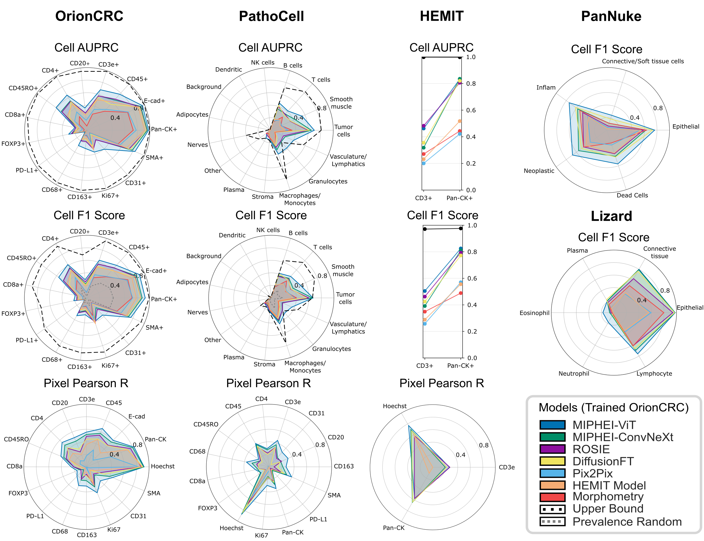

# 🧪 Benchmark Evaluation

This folder contains all scripts and utilities to evaluate H&E → mIF prediction models: pixel-level metrics, cell-level metrics, efficiency profiling, qualitative comparisons, and radar plots.

---

**Metrics computed per dataset:**

| Metric type | Datasets | Metrics |
|---|---|---|
| Pixel-level | OrionCRC, HEMIT, PathoCell | Pearson, PSNR, SSIM (per marker) |
| Cell-level | OrionCRC, HEMIT, PathoCell, Lizard, PanNuke | Cell AUPRC, F1 Score, ROC AUC |

---

## 📦 Installation

On top of the base environment setup (see [root README](../README.md#-installation)), install benchmark-specific dependencies:

```bash
pip install -r requirements_benchmark.txt
```

## 🚀 Running the Benchmark

To evaluate any model on a given dataset:

```bash
python run_benchmark.py \
    --checkpoint_dir CHECKPOINT_DIR \
    --model MODEL \
    --dataset DATASET \
    --config_dir CONFIG_DIR \
    --min_area 0
```

### Arguments

| Argument | Description |
|---|---|
| `--checkpoint_dir` | Folder containing model weights + config file |
| `--model` | Model name (must match an evaluator in `evaluators/model_evaluators/`) |
| `--dataset` | Dataset name (must match an evaluator in `evaluators/dataset_evaluators/`) |
| `--config_dir` | Path to dataset config directory (typically `config/data/`) |
| `--min_area` | Minimum nucleus area filter (default: `0`; set to `10` for OrionCRC) |

The evaluator automatically determines which metrics apply (pixel-level, cell-level, marker-level, etc.).

### Running All Evaluations (all models × all datasets)

```bash
bash benchmark/scripts/run_evaluations.sh
```

Adapt paths in the script to match your checkpoint and config locations.

---

### Running ROSIE (two-step inference)

ROSIE is significantly more computationally expensive than other methods and requires saving predictions first.

**Step 1 — Generate ROSIE predictions:**

```bash
python benchmark/scripts/rosie_inference.py \
    --checkpoint_dir CHECKPOINT_DIR \
    --pred_dir PRED_DIR \
    --dataset DATASET \
    --device cuda:0 \
    --num_workers 8
```

**Step 2 — Run the benchmark on saved predictions:**

```bash
python run_benchmark.py \
    --checkpoint_dir CHECKPOINT_DIR \
    --pred_dir PRED_DIR \
    --model rosie \
    --dataset DATASET \
    --config_dir config/data/
```

---

## 📁 Benchmark Structure

All evaluation logic is modular and located in `benchmark/evaluators/`:

1. `base_evaluator.py` — Core evaluation logic and shared metrics.
2. `dataset_evaluator.py` — Dataset-specific logic: how to read each dataset (WSI or tiles), map predicted/target markers, and split the nuclei dataframe.
3. `model_evaluator.py` — Model-specific logic: loading weights, forward passes, and outputting predicted mIF channels.

### Adding a New Dataset or Model

Create a new evaluator in:
- `dataset_evaluators/` for new datasets
- `model_evaluators/` for new models

and register it in the corresponding `__init__.py`.

---

## ⚡ Efficiency Benchmark

Measure inference speed, VRAM usage, throughput, and FLOPs:

```bash
python benchmark/scripts/benchmark_efficiency.py \
    --checkpoints_dir CHECKPOINTS_DIR
```

Runs each model on a standard 256×256 tile and reports: FLOPs, peak GPU memory, and model parameter count. `CHECKPOINTS_DIR` contains all model subfolders.

---

## 🔍 Compare Predictions

Generate side-by-side qualitative comparisons across methods:

```bash
python benchmark/scripts/generate_figure_predictions.py \
    --checkpoint_dir CHECKPOINT_DIR \
    --output_dir OUTPUT_DIR \
    --slide-index 0 \
    --data_config config/data/orion.yaml
```

Outputs per sample:
- H&E tile
- Predicted mIF channels (one image per model)
- Ground-truth mIF

---

## 📊 Radar Plots

Summarize metrics across models with radar plots:

```bash
python visualizations/radar_plots.py \
    --checkpoints_dir CHECKPOINTS_DIR \
    --save_dir OUTPUT_DIR
```

Useful for aggregate comparison of pixel-level (Pearson, PSNR, SSIM) and cell-level (Cell AUPRC, F1, ROC AUC) metrics.

<p align="center">
  <strong>Figure: Radar Plot Comparison of H&E to mIF Virtual Staining Performance</strong><br>
  
</p>

---

## ⚙️ Training Scripts

Training scripts for all benchmarked baseline models are available in the `training/` folder. See [`training/README.md`](training/README.md) for details.
